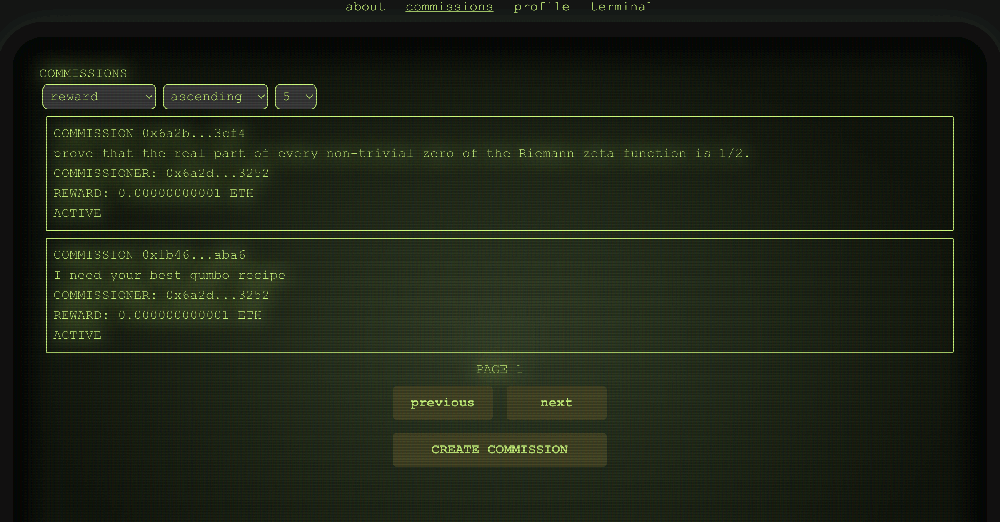

# COMMISSIONER

## Commissioner is a decentralized, censorship-resistant platform.

Check out the live app at <a href="https://commissioner.vercel.app/">https://commissioner.vercel.app/</a>

- Commissioner is built with Solidity, TypeScript, React, NextJs, and AssemblyScript.
- You must connect MetaMask to use Commissioner.
- It uses IPFS to store commission prompts and entry content.
- Once uploaded to IPFS, the prompt/content cannot be tampered with.
- The IPFS hash for the prompt/content is stored on the blockchain.
- Users may create commissions for written content.
- The topic can be anything.
- Subject matter could be journalistic, scientific, political, economic, artistic. Anything.
- Commissions can be created with an initial reward from the commissioner.
- Other users can also contribute reward to valuable commissions.
- Users may also submit entries to the commission in hopes of winning.
- Users may also vote for entries they think are valuable.
- When an entry receives votes, the value goes to their wallet address.
- 1% is taken from votes and added to the total reward.
- 1% is taken for the Commissioner system.
- Once the commission is over, the winning entry will be displayed with it, and users can tip the winner.
- When the commission is created, the commissioner sets a minimum number of days on it.
- Once the minimum number of days has been reached, the commissioner can trigger the end of the commission
- Ending a commission sends the reward to the entry author with the most votes.
- A commissioner is incentivized to do this by a small kickback.
- After another 2 days, any user can call in to trigger the end of the commission
- In this case, that user gets the kickback.
- All of these actions are indexed by the subgraph, and easily queried through graphql.
- Users profiles contain the commissions and entries they have made, the votes they have contributed, the votes they have earned, and the commissions they have won.
- In short: Say anything, and let the market decide.
